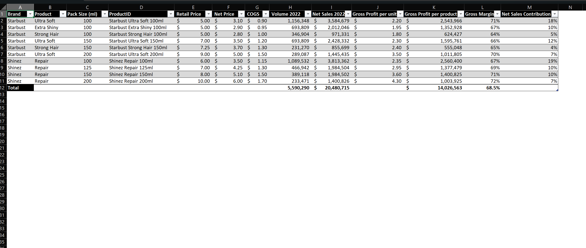
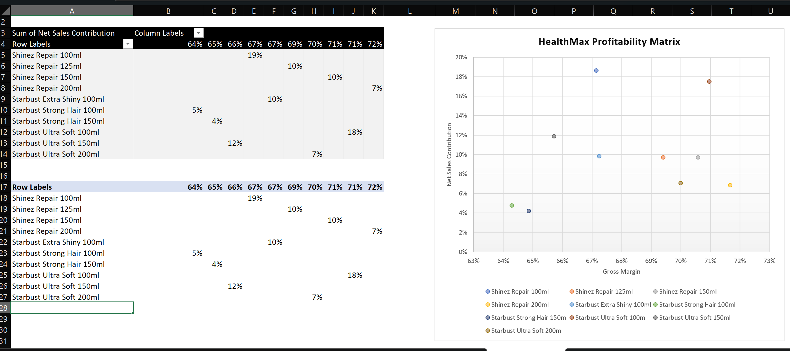

# Sales & Profitability Analysis using Excel

## Project Overview
This project analyzes FMCG sales data to understand overall sales performance, brand and product contribution, and their relationship with business profitability. The dataset covers multiple years of sales activity and is structured around key metrics such as units sold, sales value, net sales, and gross margin.

The analysis explores how sales performance varies across time, brands, products, and regions, and how metrics such as YTD (Year To Date) and MAT (Moving Annual Total) can be used to read trends and provide a general view of business performance. All analysis is conducted using Microsoft Excel.

## Project Objectives
- Understand overall sales performance and product contribution  
- Observe sales patterns across time, brands, and regions  
- Evaluate the relationship between sales volume and profitability  
- Use historical data to support trend analysis and performance overview  

## Dataset Overview
- Multi-year FMCG sales data  
- Key metrics include:
  - Units sold  
  - Sales value  
  - Net sales  
  - Gross margin  
- Data dimensions cover brand, product, category, region, and time  
- YTD and MAT metrics are used to analyze performance and sales trends  
- Data is cleaned and summarized in Excel prior to analysis  

## Key Outputs & Insights

### Overall Sales Performance

Sales performance shows noticeable variation across time periods, indicating changes in demand and sales dynamics rather than a uniform growth pattern.

### Brand & Product Performance

A relatively small number of products and brands contribute a significant portion of total net sales, while other products provide smaller but more stable contributions.

### Profitability Analysis

The profitability matrix highlights that products with high sales contribution do not always deliver the highest margins, emphasizing the importance of evaluating sales and margin together.

### Sales Forecast Overview

Historical sales data is used as a baseline to provide a forward-looking view of potential sales performance without incorporating additional strategic initiatives.

## Key Learnings
- Understanding how sales data can be interpreted in a business context  
- Using Excel to summarize and explore data effectively  
- Connecting sales metrics with profitability indicators  
- Extracting meaningful insights without unnecessary analytical complexity  

## Tools
- Microsoft Excel

## Disclaimer
This project was created for academic and educational purposes only.
All data and analysis are used solely for learning and demonstration purposes and do not represent actual business decisions or recommendations.
